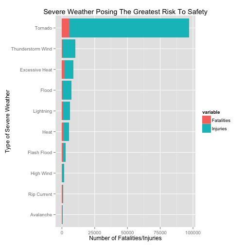

Severe Weather in the United States: Threats to Life & Property
========================================================
*Synopsis here - up to 10 sentences.

Data Processing
--------------------------------------------------------

```r
require(stringr)
```

```
## Loading required package: stringr
```

```r
require(data.table)
```

```
## Loading required package: data.table
```

```r
require(reshape2)
```

```
## Loading required package: reshape2
```

```r
require(ggplot2)
```

```
## Loading required package: ggplot2
```


For the purposes of our analysis, we use the xyz data obtained from abc.

We begin by reading the data in from file, making the assumption that the .bz2 archive containing the data is located in the R working directory.

```r
srcData <- read.csv(bzfile(file.path(getwd(), "repdata-data-StormData.csv.bz2")), 
    stringsAsFactors = FALSE)
```


We note that there are inconsistencies and incongruous values present in the ```EVTYPE``` variable, as there are ```length(unique(srcData$EVTYPE))``` unique values recorded, compared to the 48 unique values listed in the NOAA data.

In order to improve the quality of any results, we therefore conduct some cleaning of the data, beginning by imposing a consistent character-set and case.

```r
srcData$EVTYPE <- tolower(srcData$EVTYPE)
srcData$EVTYPE <- str_replace_all(srcData$EVTYPE, "[^[:alnum:/]]", " ")
```


Following this standardization, we group the data into the categories listed by NOAA (given below).

```r
noaaEVTYPE <- c("Astronomical Low Tide", "Avalanche", "Blizzard", "Coastal Flood", 
    "Cold/Wind Chill", "Debris Flow", "Dense Fog", "Dense Smoke", "Drought", 
    "Dust Devil", "Dust Storm", "Excessive Heat", "Extreme Cold/Wind Chill", 
    "Flash Flood", "Flood", "Frost/Freeze", "Funnel Cloud", "Freezing Fog", 
    "Hail", "Heat", "Heavy Rain", "Heavy Snow", "High Surf", "High Wind", "Hurricane (Typhoon)", 
    "Ice Storm", "Lake-Effect Snow", "Lakeshore Flood", "Lightning", "Marine Hail", 
    "Marine High Wind", "Marine Strong Wind", "Marine Thunderstorm Wind", "Rip Current", 
    "Seiche", "Sleet", "Storm Surge/Tide", "Strong Wind", "Thunderstorm Wind", 
    "Tornado", "Tropical Depression", "Tropical Storm", "Tsunami", "Volcanic Ash", 
    "Waterspout", "Wildfire", "Winter Storm", "Winter Weather")
```


We begin by subsetting the data based on whether any threat to safety or property was present.

As there are typographic errors present in the data, we employ regular expressions in order to robustly match the entries in the ```EVTYPE``` variable to the corresponding categories.

```r
cleanData <- data.table(subset(srcData, FATALITIES > 0 | INJURIES > 0 | PROPDMG > 
    0 | CROPDMG > 0, select = c(EVTYPE, FATALITIES, INJURIES, PROPDMG, PROPDMGEXP, 
    CROPDMG, CROPDMGEXP)))

cleanData$EVTYPE <- str_trim(cleanData$EVTYPE)

cleanData$EVTYPE[grepl("*astronomical low tide*", cleanData$EVTYPE)] <- "Astronomical Low Tide"
cleanData$EVTYPE[grepl("*avalanc(h)?e*", cleanData$EVTYPE)] <- "Avalanche"
cleanData$EVTYPE[grepl("*blizzard*", cleanData$EVTYPE)] <- "Blizzard"
cleanData$EVTYPE[grepl("*coastal flood*", cleanData$EVTYPE)] <- "Coastal Flood"
cleanData$EVTYPE[grepl("*cold/wind chill*", cleanData$EVTYPE)] <- "Cold/Wind Chill"
cleanData$EVTYPE[grepl("*debris flow*", cleanData$EVTYPE)] <- "Debris Flow"
cleanData$EVTYPE[grepl("*dense fog*", cleanData$EVTYPE)] <- "Dense Fog"
cleanData$EVTYPE[grepl("*dense smoke*", cleanData$EVTYPE)] <- "Dense Smoke"
cleanData$EVTYPE[grepl("*drought*", cleanData$EVTYPE)] <- "Drought"
cleanData$EVTYPE[grepl("*dust devil*", cleanData$EVTYPE)] <- "Dust Devil"
cleanData$EVTYPE[grepl("*dust storm*", cleanData$EVTYPE)] <- "Dust Storm"
cleanData$EVTYPE[grepl("*excessive heat*|*extreme heat*", cleanData$EVTYPE)] <- "Excessive Heat"
cleanData$EVTYPE[grepl("*extreme cold/wind chill*", cleanData$EVTYPE)] <- "Extreme Cold/Wind Chill"
cleanData$EVTYPE[grepl("*flash flood*|*flash/flood*|*flood/flash*|*flashflood*|*flood flash*", 
    cleanData$EVTYPE)] <- "Flash Flood"
cleanData$EVTYPE[grepl("*flood*", cleanData$EVTYPE)] <- "Flood"
cleanData$EVTYPE[grepl("*frost*|*frost/freeze*|*freeze*", cleanData$EVTYPE)] <- "Frost/Freeze"
cleanData$EVTYPE[grepl("*funnel cloud*", cleanData$EVTYPE)] <- "Funnel Cloud"
cleanData$EVTYPE[grepl("*freezing fog*", cleanData$EVTYPE)] <- "Freezing Fog"
cleanData$EVTYPE[grepl("*marine hail*", cleanData$EVTYPE)] <- "Marine Hail"
cleanData$EVTYPE[grepl("*hail*", cleanData$EVTYPE)] <- "Hail"
cleanData$EVTYPE[grepl("*heat*", cleanData$EVTYPE)] <- "Heat"

# 'Heavy Rain', 'Heavy Snow', 'High Surf'

cleanData$EVTYPE[grepl("*marine high wind*", cleanData$EVTYPE)] <- "Marine High Wind"
cleanData$EVTYPE[grepl("*high wind*", cleanData$EVTYPE)] <- "High Wind"
cleanData$EVTYPE[grepl("*hurricane*", cleanData$EVTYPE)] <- "Hurricane (Typhoon)"

# 'Ice Storm', 'Lake-Effect Snow', 'Lakeshore Flood', 'Lightning'

cleanData$EVTYPE[grepl("*marine strong wind*", cleanData$EVTYPE)] <- "Marine Strong Wind"
cleanData$EVTYPE[grepl("*marine thunderstorm wind*", cleanData$EVTYPE)] <- "Marine Thunderstorm Wind"
cleanData$EVTYPE[grepl("*rip current*", cleanData$EVTYPE)] <- "Rip Current"
cleanData$EVTYPE[grepl("*seiche*", cleanData$EVTYPE)] <- "Seiche"
cleanData$EVTYPE[grepl("*sleet*", cleanData$EVTYPE)] <- "Sleet"
cleanData$EVTYPE[grepl("*storm surge/tide*", cleanData$EVTYPE)] <- "Storm Surge/Tide"


cleanData$EVTYPE[grepl("*thunde(e)?r(e)?storm*|*tstm*|*thunderstrom*", cleanData$EVTYPE)] <- "Thunderstorm Wind"
cleanData$EVTYPE[grepl("*torn(a)?do*", cleanData$EVTYPE)] <- "Tornado"

types <- unique(cleanData$EVTYPE)
types[order(types)]
```

```
##   [1] "?"                         "apache county"            
##   [3] "astronomical high tide"    "Astronomical Low Tide"    
##   [5] "Avalanche"                 "beach erosion"            
##   [7] "black ice"                 "Blizzard"                 
##   [9] "blowing dust"              "blowing snow"             
##  [11] "brush fire"                "coastal erosion"          
##  [13] "Coastal Flood"             "coastal storm"            
##  [15] "coastal surge"             "coastalstorm"             
##  [17] "cold"                      "cold and snow"            
##  [19] "cold and wet conditions"   "cold temperature"         
##  [21] "cold wave"                 "cold weather"             
##  [23] "Cold/Wind Chill"           "cold/winds"               
##  [25] "cool and wet"              "dam break"                
##  [27] "Dense Fog"                 "Dense Smoke"              
##  [29] "downburst"                 "Drought"                  
##  [31] "drowning"                  "dry microburst"           
##  [33] "dry mircoburst winds"      "Dust Devil"               
##  [35] "Dust Storm"                "Excessive Heat"           
##  [37] "excessive rainfall"        "excessive snow"           
##  [39] "excessive wetness"         "extended cold"            
##  [41] "extreme cold"              "extreme wind chill"       
##  [43] "extreme windchill"         "falling snow/ice"         
##  [45] "Flash Flood"               "Flood"                    
##  [47] "fog"                       "fog and cold temperatures"
##  [49] "forest fires"              "Frost/Freeze"             
##  [51] "Funnel Cloud"              "glaze"                    
##  [53] "glaze ice"                 "glaze/ice storm"          
##  [55] "gradient wind"             "grass fires"              
##  [57] "gustnado"                  "gusty wind"               
##  [59] "gusty wind/hvy rain"       "gusty wind/rain"          
##  [61] "gusty winds"               "Hail"                     
##  [63] "hazardous surf"            "Heat"                     
##  [65] "high"                      "high  winds"              
##  [67] "high seas"                 "high surf"                
##  [69] "high surf advisory"        "high swells"              
##  [71] "high tides"                "high water"               
##  [73] "high waves"                "High Wind"                
##  [75] "Hurricane (Typhoon)"       "hvy rain"                 
##  [77] "hyperthermia/exposure"     "hypothermia"              
##  [79] "hypothermia/exposure"      "ice"                      
##  [81] "ice and snow"              "ice floes"                
##  [83] "ice jam"                   "ice on road"              
##  [85] "ice roads"                 "ice storm"                
##  [87] "ice/strong winds"          "icy roads"                
##  [89] "lake effect snow"          "lake-effect snow"         
##  [91] "landslide"                 "landslides"               
##  [93] "landslump"                 "landspout"                
##  [95] "late season snow"          "light snow"               
##  [97] "light snowfall"            "lighting"                 
##  [99] "lightning"                 "lightning  wauseon"       
## [101] "lightning fire"            "lightning injury"         
## [103] "lightning."                "ligntning"                
## [105] "low temperature"           "marine accident"          
## [107] "Marine Hail"               "Marine High Wind"         
## [109] "marine mishap"             "Marine Strong Wind"       
## [111] "Marine Thunderstorm Wind"  "microburst"               
## [113] "microburst winds"          "mixed precip"             
## [115] "mixed precipitation"       "mud slide"                
## [117] "mud slides"                "mudslide"                 
## [119] "mudslides"                 "non-severe wind damage"   
## [121] "other"                     "rain"                     
## [123] "rain/snow"                 "rain/wind"                
## [125] "rainstorm"                 "rapidly rising water"     
## [127] "record cold"               "record rainfall"          
## [129] "record snow"               "Rip Current"              
## [131] "rock slide"                "rogue wave"               
## [133] "rough seas"                "rough surf"               
## [135] "Seiche"                    "severe turbulence"        
## [137] "Sleet"                     "snow"                     
## [139] "snow accumulation"         "snow and ice"             
## [141] "snow and ice storm"        "snow squall"              
## [143] "snow squalls"              "snow/ bitter cold"        
## [145] "snow/ ice"                 "snow/blowing snow"        
## [147] "snow/cold"                 "snow/ice"                 
## [149] "snow/ice storm"            "storm force winds"        
## [151] "storm surge"               "Storm Surge/Tide"         
## [153] "strong wind"               "strong winds"             
## [155] "thuderstorm winds"         "thundersnow"              
## [157] "Thunderstorm Wind"         "thundertorm winds"        
## [159] "thunerstorm winds"         "Tornado"                  
## [161] "torrential rainfall"       "tropical depression"      
## [163] "tropical storm"            "tropical storm alberto"   
## [165] "tropical storm dean"       "tropical storm gordon"    
## [167] "tropical storm jerry"      "tsunami"                  
## [169] "tunderstorm wind"          "typhoon"                  
## [171] "unseasonable cold"         "unseasonably cold"        
## [173] "unseasonably warm"         "unseasonably warm and dry"
## [175] "unseasonal rain"           "urban and small"          
## [177] "urban small"               "urban/small stream"       
## [179] "urban/sml stream fld"      "volcanic ash"             
## [181] "warm weather"              "waterspout"               
## [183] "waterspout-"               "wet microburst"           
## [185] "whirlwind"                 "wild fires"               
## [187] "wild/forest fire"          "wild/forest fires"        
## [189] "wildfire"                  "wildfires"                
## [191] "wind"                      "wind and wave"            
## [193] "wind damage"               "wind storm"               
## [195] "winds"                     "winter storm"             
## [197] "winter storms"             "winter weather"           
## [199] "winter weather mix"        "winter weather/mix"       
## [201] "wintry mix"
```


We note that several classes of entry in the ```EVTYPE`` variable do not map readily to any of the NOAA categories, and as such we discard these.


We begin the analysis proper of the cleaned data by attempting to answer the question "Across the United States, which types of events (as indicated in the EVTYPE variable) are most harmful with respect to population health?"

```r
# Getting the total number of fatalities & injuries for each event-type.
Fatalities <- cleanData[, sum(FATALITIES), by = EVTYPE]
Injuries <- cleanData[, sum(INJURIES), by = EVTYPE]

x <- data.table(types, Fatalities$V1, Injuries$V1)
setnames(x, old = c("types", "V2", "V3"), new = c("EVTYPE", "Fatalities", "Injuries"))
x <- x[with(x, order(-Fatalities, -Injuries)), ]

rankedLife <- head(x, 25)
moltenLife <- melt(rankedLife, id.vars = "EVTYPE")
```


We now consider the question "Across the United States, which types of events have the greatest economic consequences?"

```r
# Sorting out the exponentials.
multipliers <- c(1, 1000, 1e+06, 1e+09)
chars <- c("H", "K", "M", "B")
cleanData$PROPDMGEXP <- factor(toupper(cleanData$PROPDMGEXP))  #, levels <- multipliers, names <- chars)

# Calculating the monetary damage.
data$PROPDMG_CALC <- data$PROPDMG * multipliers[PROPDMGEXP]
```

```
## Error: object of type 'closure' is not subsettable
```

```r
data$CROPDMG_CALC <- data$CROPDMG * multipliers[CROPDMGEXP]
```

```
## Error: object of type 'closure' is not subsettable
```

```r

# Getting the 25 most damaging event types.
resultsProp <- DT[, sum(PROPDMG_CALC + CROPDMG_CALC), by = EVTYPE]
```

```
## Error: object 'DT' not found
```

```r
resultsProp <- resultsProp[order(V1, na.last = TRUE, decreasing = TRUE), ]
```

```
## Error: object 'resultsProp' not found
```

```r
rankedProp <- head(resultsProp, 25)
```

```
## Error: object 'resultsProp' not found
```


Results
--------------------------------------------------------


```r
life <- ggplot(moltenLife, aes(x = reorder(EVTYPE, value), y = value, group = EVTYPE, 
    fill = variable))
life <- life + geom_bar(stat = "identity") + coord_flip()
life <- life + ggtitle("Severe Weather Posing The Greatest Risk To Safety") + 
    ylab("Number of Fatalities/Injuries") + xlab("Type of Severe Weather")
print(life)
```

 


```r
prop <- ggplot(rankedProp, aes(x = reorder(EVTYPE, value), y = value)) + geom_bar(stat = "identity")
```

```
## Error: object 'rankedProp' not found
```

```r
prop <- prop + coord_flip()
```

```
## Error: object 'prop' not found
```

```r
prop(prop)
```

```
## Error: could not find function "prop"
```


We conclude that the greatest threats to public safety are Tornados, and that the most economically damaging events are Hurricanes (Typhoons).
